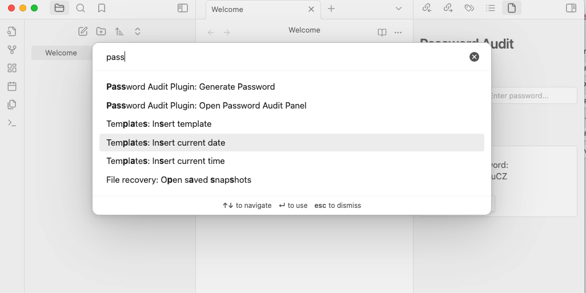
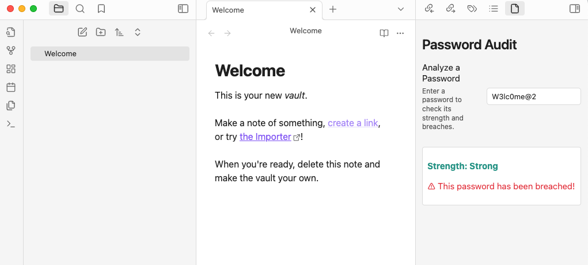
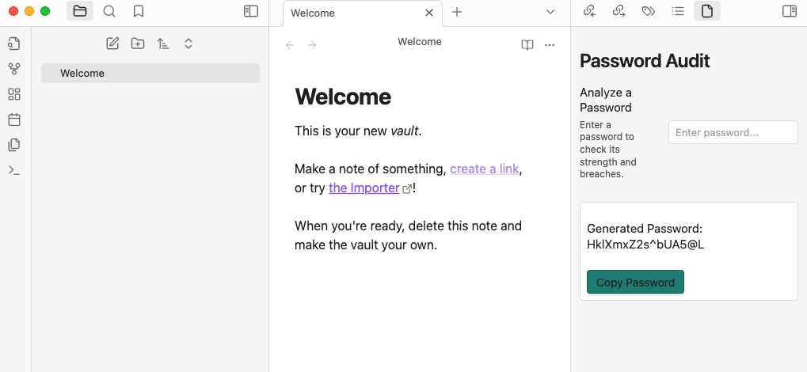

# **🔒 Password Audit Plugin**

A powerful Obsidian plugin designed to **analyze password strength**, check for security breaches, and **generate secure passwords** with ease.

---

## **✨ Features**

- **🔑 Password Strength Analysis**: Get detailed feedback on the strength of any password.
- **🌐 Breached Password Check**: Verify if a password has been compromised in known data breaches using [Have I Been Pwned](https://haveibeenpwned.com/).
- **🔐 Secure Password Generation**: Easily generate strong, secure passwords with customizable lengths.
- **📋 Clipboard Support**: Copy generated passwords to the clipboard with just one click.

---

## **📥 Installation**

1. Open **Settings** in Obsidian.
2. Navigate to **Community Plugins**.
3. Click **Browse** and search for `Password Audit Plugin`.
4. Install the plugin and enable it.

---

## **🛠️ Usage**

1. Open the Password Audit panel via the command palette (`Ctrl+P` or `Cmd+P`) and select **"Open Password Audit Panel"**.
2. **Analyze a Password**:
   - Enter a password into the text box to check its strength and verify if it has been breached.
3. **Generate a Password**:
   - Use the `Generate Secure Password` command to create a strong password.
   - Click **Copy Password** to copy the generated password to your clipboard.

---

## **📸 Screenshots**

### **Access the Plugin**


### **Password Strength Analysis**


### **Generate Secure Passwords**


---

## **💻 Development Setup**

If you'd like to contribute or test the plugin locally, follow these steps:

1.  Clone the repository:
   ```bash
   git clone https://github.com/pulisettis/Password-Audit-Plugin.git
   cd Password-Audit-Plugin
```

2. Install Dependencies
```bash
npm install
```
3. Build the Plugin
```bash
npm run build
```
4. Copy the compiled files to your `.obsidian/plugins` folder to test it locally.

## **🤝 Contributing**
Contributions are welcome! If you have ideas for improvement or new features, feel free to fork the repository, make your changes, and submit a pull request. Let's make this plugin even better!

## **📢 Disclaimer**

⚠️ **Important**: Obsidian is not designed for securely storing sensitive information like passwords. Use this plugin only for auditing and generating passwords, not for storing them. Always use a dedicated password manager for secure storage.

## **🌟 Stay Connected**

-   Follow me on [Twitter](https://twitter.com/pulisettis): **@pulisettis**
-   Check out my other projects on [GitHub](https://github.com/prashanthpulisetti).


